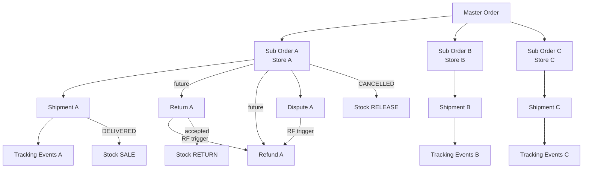

# SCS-M7.3 Pre-Implementation Architecture & Business Flow Audit

> **Milestone**: M7.3 — Post-Purchase, Delivery Completion & Exception Management
> **Auditor Role**: Principal Software Architect / Backend / Database / Security / QA
> **Status**: READ-ONLY AUDIT — No production code modified
> **Date**: 2026-09-29
> **Baseline**: develop branch, post M7.2.4-A.1 verification

---

# 1. Executive Summary

This audit inspects the SCS Platform repository to determine the architecture and implementation plan for **M7.3 — Post-Purchase, Delivery Completion & Exception Management**.

**Key Finding**: The platform has a well-structured order FSM (16 statuses), a robust shipment lifecycle, carrier integration with retry/circuit-breaker, and a transactional outbox. However, **the post-purchase domain has critical gaps**:

1. **No payment module** — no payment capture, authorization, or settlement exists
2. **No refund capability** — no refund tables, services, or APIs
3. **No return capability** — no return tables, services, or APIs
4. **Master order status never updates** after checkout — remains `SUBMITTED` permanently
5. **No delivery completion logic** — DELIVERED → COMPLETED transition has no auto-advance
6. **No buyer delivery confirmation** mechanism
7. **Disputes exist but are financially disconnected** — no refund trigger on resolution
8. **Inventory return-to-stock** is not implemented

**Verdict**: `GO WITH CONDITIONS`

The platform has strong foundations (order FSM, shipment lifecycle, outbox, carrier integration, tenant isolation). M7.3 must address the master-order aggregation gap, delivery completion, cancellation/exception handling, and lay the groundwork for returns/refunds. A full dispute/refund/return implementation is recommended as later sub-milestones.

---

# 2. Repository / Environment Inspected

| Component | Path | Notes |
|-----------|------|-------|
| API (NestJS) | `apps/api/src/` | 20 modules |
| Web (Next.js) | `apps/web/src/` | Buyer + merchant UI |
| Mobile (Flutter) | `mobile/lib/` | Buyer + merchant + driver |
| Migrations | `infra/drizzle/migrations/` | 0001–0046 |
| Admin | `apps/admin/src/` | Admin UI |
| B2B Test App | `apps/scs-platform-b2-test/` | Integration test harness |

**Modules inspected**: orders, shipping, inventory, notifications, audit, reviews (disputes), support, identity, merchant, catalog, pricing, promotions, analytics, realtime, delivery (empty).

**Migrations**: Latest is `0046_carrier_operations_hardening.sql`.

---

# 3. Current Architecture

## 3.1 Domain Model

```
master_orders (1)
  └── orders (N) — sub-orders, one per merchant store
        ├── order_items (N) — line items with snapshot prices
        ├── order_financial_breakdown (1) — subtotal/discount/tax/commission/net
        ├── order_status_history (N) — append-only transition log
        └── shipments (1) — one fulfillment shipment per sub-order [UNIQUE(order_id)]
              └── shipment_events (N) — append-only fulfillment log
```

**Files**:
- `apps/api/src/modules/orders/orders.schema.ts` — master_orders, orders, order_items, order_financial_breakdown, order_status_history
- `apps/api/src/modules/orders/shipment.schema.ts` — shipments, shipment_events
- `apps/api/src/modules/inventory/inventory.schema.ts` — inventory_items, stock_movements
- `apps/api/src/modules/audit/audit.schema.ts` — audit_logs, outbox_events, feature_flags, analytics_events
- `apps/api/src/modules/notifications/notifications.schema.ts` — notifications, notification_preferences, device_tokens
- `apps/api/src/modules/reviews/support.schema.ts` — disputes, dispute_events, conversations, messages

## 3.2 Key Infrastructure

| Component | File | Purpose |
|-----------|------|---------|
| Outbox Dispatcher | `common/outbox/outbox-dispatcher.service.ts` | Polls PENDING events, dispatches with exponential backoff |
| Tenant Scope | `common/tenant-scope.ts` | Object-level authorization: resource → store → org |
| Realtime Gateway | `modules/realtime/realtime.gateway.ts` | WebSocket push for order status + notifications |
| Shipping Carrier Worker | `modules/shipping/shipping-carrier.worker.ts` | Polls carrier create events, handles retries |
| Tracking Poller | `modules/shipping/carrier-tracking-poller.ts` | Polls carrier for tracking updates |
| Reconciliation | `modules/shipping/carrier-reconciliation.service.ts` | Detects shipments stuck in non-terminal state |
| Circuit Breaker | `modules/shipping/carrier-circuit-breaker.ts` | Per-provider circuit breaker |
| Retry Policy | `modules/shipping/carrier-retry-policy.ts` | Exponential backoff for carrier operations |

---

# 4. Current Order State Machine

## 4.1 Sub-Order FSM (16 statuses)

**Source**: `apps/api/src/modules/orders/orders.service.ts` lines 1908–1925

```
DRAFT → SUBMITTED → PENDING_CONFIRMATION → ACCEPTED | PARTIALLY_ACCEPTED | REJECTED | CANCELLED
ACCEPTED / PARTIALLY_ACCEPTED → PREPARING → READY → OUT_FOR_DELIVERY → DELIVERED → COMPLETED
READY → ASSIGNED → PICKED_UP → OUT_FOR_DELIVERY
DELIVERED → DISPUTED (≤72h)
COMPLETED → DISPUTED (≤72h)
Any pre-DELIVERED → CANCELLED
```

### Transition Matrix

| From | Allowed Transitions | Actor |
|------|-------------------|-------|
| DRAFT | SUBMITTED | System (checkout) |
| SUBMITTED | PENDING_CONFIRMATION | System (auto-advance) |
| PENDING_CONFIRMATION | ACCEPTED, PARTIALLY_ACCEPTED, REJECTED, CANCELLED | Merchant |
| ACCEPTED | PREPARING, CANCELLED | Merchant |
| PARTIALLY_ACCEPTED | PREPARING, CANCELLED | Merchant |
| PREPARING | READY, CANCELLED | Merchant |
| READY | OUT_FOR_DELIVERY, ASSIGNED, DELIVERED, CANCELLED | Merchant/Driver |
| ASSIGNED | PICKED_UP | Driver |
| PICKED_UP | OUT_FOR_DELIVERY | Driver |
| OUT_FOR_DELIVERY | DELIVERED | Driver |
| DELIVERED | COMPLETED, DISPUTED | System/Buyer |
| COMPLETED | DISPUTED | Buyer |
| PAYMENT_PENDING | PREPARING, CANCELLED | System |
| CANCELLED | (terminal) | — |
| REJECTED | (terminal) | — |
| DISPUTED | (terminal) | — |

### Side Effects per Transition

| Transition | Inventory | Outbox Event | Shipment | Notification |
|-----------|-----------|-------------|----------|-------------|
| ACCEPTED | RESERVE stock | order.accepted | Created (PREPARING) | order.accepted to buyer |
| PARTIALLY_ACCEPTED | RESERVE confirmed qty | order.partially_accepted | Created | order.partially_accepted |
| REJECTED | RELEASE reserved | order.rejected | — | order.rejected |
| CANCELLED | RELEASE reserved | order.cancelled | — | order.cancelled |
| PREPARING | — | order.fulfillment.preparing | → PREPARING | — |
| READY | — | order.fulfillment.ready | → READY | — |
| ASSIGNED | — | order.fulfillment.assigned | → ASSIGNED + driver | — |
| PICKED_UP | — | order.fulfillment.picked_up | → PICKED_UP | — |
| OUT_FOR_DELIVERY | — | order.fulfillment.out_for_delivery | → OUT_FOR_DELIVERY | — |
| DELIVERED | SALE (consume) | order.fulfillment.delivered | → DELIVERED | order.delivered |
| COMPLETED | — | order.completed | → COMPLETED | — |

## 4.2 Master Order FSM

**CRITICAL FINDING**: The master order has **no state machine**. Its status is set to `SUBMITTED` at checkout (line 386) and **is never updated** by any code path.

```
master_orders.status = 'SUBMITTED' at checkout
  → Never advanced to ACCEPTED, DELIVERED, COMPLETED, etc.
  → No aggregation of sub-order statuses
  → No API endpoint updates master_orders.status
```

**Evidence**: `grep masterStatus` returns only one read at `getTracking()` (line 1467). No write to `masterOrders.status` exists outside the checkout insert.

**Impact**: The buyer's "my orders" list shows master orders stuck at SUBMITTED regardless of actual fulfillment progress. Multi-merchant order progress is invisible at the master level.

---

# 5. Current Shipment State Machine

**Source**: `apps/api/src/modules/orders/shipment.schema.ts`

Shipment status **mirrors** sub-order status. There is no independent shipment FSM — the `shipments.status` column is updated in lockstep with `orders.status` by `fulfillmentTransition()` and `driverFulfillmentTransition()`.

```
PREPARING → READY → ASSIGNED → PICKED_UP → OUT_FOR_DELIVERY → DELIVERED → COMPLETED
```

**Timestamps**: `assignedAt`, `pickedUpAt`, `outForDeliveryAt`, `deliveredAt`, `completedAt` — all nullable, populated on transition.

**Carrier state** (separate from fulfillment status):
- `carrierCreateStatus`: PENDING / IN_PROGRESS / SUCCESS / FAILED / RECOVERY_REQUIRED
- `carrierStatusRaw` / `carrierStatusMapped`: last carrier status
- `recoveryStatus`: reconciliation tracking

**UNIQUE constraint**: `shipments.UNIQUE(order_id)` — exactly one shipment per sub-order (migration 0040).

---

# 6. Current Payment State Machine

**NOT VERIFIED FROM CURRENT REPOSITORY — NO PAYMENT MODULE EXISTS**

There is no `payments` module, no payment tables, no payment schema, no payment service, and no payment controller. The `apps/api/src/modules/payments` directory does not exist.

The only financial representation is:
- `order_financial_breakdown` — static breakdown at checkout time (products, discount, delivery, tax, commission, merchant_net)
- `orders.totalMinor` / `subtotalMinor` / `discountMinor` / `deliveryFeeMinor` / `taxMinor`

**This means**:
- No payment authorization or capture
- No payment state transitions
- No payment provider integration
- No concept of "paid" vs "unpaid"
- No refund capability
- No seller revenue recognition

---

# 7. Current Inventory Lifecycle

**Source**: `apps/api/src/modules/inventory/inventory.service.ts`, `apps/api/src/modules/orders/orders.service.ts` (reserveStock, settleStockForStatus)

### Movement Types

| Type | Effect | Trigger |
|------|--------|---------|
| IMPORT | +qtyOnHand | Initial stock creation |
| ADJUST | ±qtyOnHand | Manual adjustment, warehouse transfer |
| RESERVE | +qtyReserved | Merchant acceptance |
| RELEASE | -qtyReserved | Cancellation, rejection |
| SALE | -qtyOnHand, -qtyReserved | Delivery |

### Lifecycle

```
Checkout → NO inventory change
Accept → RESERVE (qtyReserved += confirmed_qty)
  → Partial accept → RESERVE (only confirmed quantities)
Cancel/Reject → RELEASE (qtyReserved -= reserved_qty)
Deliver → SALE (qtyOnHand -= qty, qtyReserved -= qty)
Return → NOT SUPPORTED
```

### Concurrency Protection

- `reserveStock()`: SELECT ... FOR UPDATE inside transaction (line 1692–1706)
- `settleStockForStatus()`: SELECT ... FOR UPDATE per inventory item (line 1801–1806)
- `releaseStock()`: SELECT ... FOR UPDATE with clamp to zero (line 374–379)
- Outstanding calculation prevents double-release (line 1783–1794)

### Gap: No Return-to-Stock

When a delivered order is disputed or goods are returned, there is no mechanism to:
- Increment `qtyOnHand` (returned goods back to warehouse)
- Record a RETURN movement type
- Conditionally return (inspect first, then decide)

---

# 8. Current Carrier Architecture

**Source**: `apps/api/src/modules/shipping/`

```
CarrierProvider (interface)
  ├── AramexProvider (Aramex SOAP/REST integration)
  └── ManualDeliveryProvider (manual driver delivery)

ShippingCarrierWorker
  → Polls for PENDING carrier_create events (FOR UPDATE SKIP LOCKED)
  → Creates carrier shipments via provider
  → Handles retries with exponential backoff
  → Circuit breaker per provider

CarrierTrackingPoller
  → Polls carrier for tracking updates on SUCCESS shipments
  → Maps external statuses → internal mapped statuses
  → Prevents regression (terminal status protection)
  → Deduplication via external_event_id

CarrierReconciliation
  → Detects shipments stuck in non-terminal carrier state
  → FOR UPDATE SKIP LOCKED claim
  → Schedules next_reconciliation_at

CarrierWebhookController
  → Receives carrier webhook callbacks
  → Verifies HMAC tokens
  → Parses provider-specific payloads
  → Inserts tracking events with dedup
```

### Terminal Statuses (carrier-mapped)

From `carrier-tracking-poller.ts`: `DELIVERED`, `CANCELLED`, `COMPLETED`

### Carrier → Order State Influence

**CRITICAL GAP**: When a carrier tracking event reports DELIVERED, the carrier system updates `shipment_events` and `shipments.carrierStatusMapped`, but **does NOT transition the sub-order or master order to DELIVERED**. The order FSM is only driven by:
1. Manual merchant/driver API calls (`POST /orders/:id/deliver`)
2. The `deliverOrder()` method which requires DRIVER/ADMIN role

There is no automated carrier-event → order-status bridge.

---

# 9. Post-Purchase Flow Analysis

### Complete Lifecycle Trace

```
Cart → Checkout → Master Order (SUBMITTED) + Sub Orders (SUBMITTED)
  → Auto-advance → Sub Orders (PENDING_CONFIRMATION)
  → Merchant Accept → Sub Order (ACCEPTED) + Shipment (PREPARING) + Stock RESERVED
  → Merchant Prepare → Sub Order (PREPARING) + Shipment (PREPARING)
  → Merchant Ready → Sub Order (READY) + Shipment (READY)
  → Driver Assign → Sub Order (ASSIGNED) + Shipment (ASSIGNED)
  → Driver Pickup → Sub Order (PICKED_UP) + Shipment (PICKED_UP)
  → Driver OFD → Sub Order (OUT_FOR_DELIVERY) + Shipment (OUT_FOR_DELIVERY)
  → Driver Deliver → Sub Order (DELIVERED) + Shipment (DELIVERED) + Stock SOLD
  → ??? → Sub Order (COMPLETED) + Shipment (COMPLETED) ← NO AUTO-ADVANCE
  → Master Order → ALWAYS SUBMITTED ← NEVER UPDATED
```

### What Happens After Delivery?

| Question | Answer |
|----------|--------|
| Does shipment become DELIVERED? | Yes — via `deliverOrder()` |
| Does sub-order become DELIVERED? | Yes — atomically with shipment |
| Does sub-order become COMPLETED? | Only via manual `transitionStatus()` — no auto-advance |
| Does master order update? | **NO — master order status never updates** |
| Is inventory consumed? | Yes — `settleStockForStatus('DELIVERED')` emits SALE |
| Is payment captured/finalized? | **NO — no payment module exists** |
| Is seller revenue recognized? | **NO — `order_financial_breakdown.merchantNetMinor` is static** |
| Is a notification generated? | Yes — `order.delivered` template exists |
| Is there buyer confirmation? | **NO — no buyer delivery confirmation mechanism** |
| Is there automatic completion? | **NO — DELIVERED → COMPLETED requires manual API call** |
| Can delivery be reversed? | **NO — DELIVERED is terminal except for DISPUTED** |

---

# 10. Multi-Merchant Order Analysis

### Current State

A master order with 3 merchants:

```
Master Order #1000 (status: SUBMITTED — always)
  ├── Sub Order A (Store A) → DELIVERED
  ├── Sub Order B (Store B) → OUT_FOR_DELIVERY
  └── Sub Order C (Store C) → REJECTED
```

**Expected master order behavior**: NOT DEFINED. The master order has no aggregation logic.

### Required Behavior (Technical Recommendation)

| Sub-Order Combination | Recommended Master Status |
|----------------------|--------------------------|
| All SUBMITTED/PENDING_CONFIRMATION | SUBMITTED |
| Any ACCEPTED, none DELIVERED | ACCEPTED (partial) |
| Any DELIVERED, none COMPLETED | PARTIALLY_DELIVERED |
| All DELIVERED | DELIVERED |
| All COMPLETED | COMPLETED |
| Any DISPUTED | Review required |
| All CANCELLED/REJECTED | CANCELLED |

**BUSINESS DECISION REQUIRED**: Should the master order reflect the "most advanced" sub-order, or require all sub-orders to reach a state? Options:
1. **Optimistic**: master = highest sub-order status
2. **Pessimistic**: master = lowest non-terminal sub-order status
3. **Composite**: master has its own statuses (PARTIALLY_DELIVERED, etc.)

### Can one merchant's failure affect another?

**Currently: NO** — sub-orders are independent. One merchant's rejection does not affect other merchants' sub-orders. This is correct for isolation but means the buyer experience is fragmented.

---

# 11. Delivery Completion Analysis

### Current Delivery Path

`deliverOrder()` at line 1359:
1. Verify caller role (DRIVER/ADMIN/SUPER_ADMIN)
2. Verify transition allowed (OUT_FOR_DELIVERY → DELIVERED)
3. Verify driver ownership of shipment
4. Atomic optimistic lock on order status
5. Settle stock (SALE movement)
6. Update shipment status + deliveredAt
7. Insert shipment event
8. Record status history
9. Publish outbox event `order.fulfillment.delivered`
10. Emit realtime event

### Gaps

| Gap | Severity | Description |
|-----|----------|-------------|
| No auto COMPLETED | HIGH | DELIVERED orders remain DELIVERED forever |
| No master order update | CRITICAL | Master order never reflects delivery |
| No buyer confirmation | MEDIUM | No "confirm receipt" mechanism |
| No payment capture | CRITICAL | No payment module at all |
| No carrier→order bridge | HIGH | Carrier DELIVERED event doesn't auto-transition order |
| No delivery proof | MEDIUM | No photo/signature capture |

---

# 12. Cancellation Analysis

### Current Cancellation Capability

**Source**: `cancelOrder()` at line 935

| Stage | Can Cancel? | Who? | Inventory Effect | Payment Effect |
|-------|------------|------|-----------------|---------------|
| Before merchant acceptance (SUBMITTED/PENDING_CONFIRMATION) | Yes | Buyer (owner), Merchant (org), Admin | Release reserved (if any) | None |
| After acceptance (ACCEPTED/PARTIALLY_ACCEPTED) | Yes | Same | RELEASE reserved stock | None |
| Before shipment (PREPARING) | Yes | Same | RELEASE | None |
| After shipment creation (READY) | Yes | Same | RELEASE | None |
| After carrier pickup (PICKED_UP) | **NO** | — | — | — |
| In transit (OUT_FOR_DELIVERY) | **NO** | — | — | — |
| Delivered | **NO** | — | — | — |
| Completed | **NO** | — | — | — |

### Concurrency Analysis

- `cancelOrder()` calls `transitionStatus()` which calls `settleStockForStatus()` before the status write
- `settleStockForStatus()` uses SELECT ... FOR UPDATE per inventory item
- **But**: `transitionStatus()` does NOT use optimistic locking (no `WHERE status = currentStatus`) — it uses a plain `UPDATE ... WHERE id = orderId`
- **Race condition**: cancellation can race with acceptance — both could attempt to write status

### Missing Cancellation Scenarios

| Scenario | Current Handling | Required |
|----------|-----------------|----------|
| Merchant cancels after acceptance | Not supported | Must release stock, notify buyer, potentially trigger refund |
| Carrier cancels shipment | Not supported | Must update shipment, potentially re-fulfill or refund |
| Admin cancels in-transit | Not supported | Requires carrier interception + stock return + refund |
| Cancellation races with acceptance | Partially protected | Needs explicit optimistic lock |
| Post-delivery cancellation | Not supported | Must go through dispute flow |

---

# 13. Delivery Exception Analysis

| Exception | Current Behavior | Risk | Required Handling |
|-----------|-----------------|------|-------------------|
| Delivery failed | **No handling** | HIGH | Shipment → FAILED, sub-order → needs re-fulfill or cancel |
| Recipient unavailable | **No handling** | MEDIUM | Carrier retry or return-to-merchant |
| Wrong address | **No handling** | HIGH | Dispute flow + potential refund |
| Carrier rejected shipment | **No handling** | HIGH | Recovery status + re-fulfillment |
| Shipment lost | **No handling** | CRITICAL | Detection via reconciliation timeout |
| Shipment damaged | **No handling** | HIGH | Dispute + refund |
| Shipment returned | **No handling** | MEDIUM | Return-to-stock + refund |
| Shipment cancelled | Partially handled | MEDIUM | `cancelledAt` tracked but no order impact |
| Carrier timeout | Circuit breaker opens | MEDIUM | Recovery queue exists |
| Duplicate delivery event | Protected | LOW | UNIQUE on `external_event_id` (migration 0046) |
| Out-of-order event | Protected | LOW | Regression prevention in tracking poller |
| Unknown carrier status | Mapped to `null` | LOW | Logged but not acted upon |

---

# 14. Returns Analysis

**RETURNS DO NOT EXIST IN THE CURRENT CODEBASE**

No return tables, services, controllers, or APIs exist. The domain requires:

### Recommended Return Architecture

```
Return Request (buyer initiates within return window)
  → Return Item (per order_item)
  → Return Approval (merchant or system)
  → Return Shipment (buyer ships back)
  → Return Received (merchant confirms receipt)
  → Return Inspection (optional)
  → Return Accepted/Rejected
  → Refund Trigger (if accepted)
  → Stock Return (if applicable)
```

### Aggregate Boundary Recommendation

Returns should attach to **order_items** (sub-order line items), not the master order or sub-order as a whole. Rationale:
- A buyer may return individual items from a sub-order
- Multi-merchant returns are naturally scoped per sub-order
- Refund calculations need per-item granularity

### BUSINESS DECISIONS REQUIRED

- Return window (14 days? 30 days?)
- Who pays return shipping?
- Restocking fee policy?
- Condition requirements?
- Auto-approve threshold?

---

# 15. Refund Analysis

**REFUNDS DO NOT EXIST IN THE CURRENT CODEBASE**

No payment module means no refund capability. When returns or disputes are resolved in the buyer's favor, there is no mechanism to return funds.

### Recommended Refund Architecture

```
Payment (if/when payment module is built)
  → Payment Allocation (per sub-order)
  → Refund (admin/system initiated)
  → Refund Item (per order_item or partial amount)
```

### Refund Triggers

| Trigger | Condition | Amount |
|---------|-----------|--------|
| Return accepted | After return inspection | Item price + possibly shipping |
| Dispute resolved for buyer | Admin decision | Full or partial |
| Delivery failed + no re-fulfill | After exception handling | Full sub-order |
| Merchant cancellation after payment | After acceptance failure | Full sub-order |

### Idempotency Requirements

- Refund creation must be idempotent (unique constraint on source transaction + reference)
- Refund processing must handle external provider failures
- Partial refunds must track cumulative refund amount vs original payment

---

# 16. Dispute Analysis

### Current State

**Source**: `apps/api/src/modules/reviews/disputes.service.ts`, `support.schema.ts`

Disputes exist with the following capabilities:

| Feature | Status | Notes |
|---------|--------|-------|
| Create dispute | Yes | From DELIVERED orders within 72h |
| Submit evidence | Yes | By either party |
| Submit response | Yes | By respondent only |
| Resolve dispute | Yes | By admin (support:disputes:resolve) |
| Dispute events | Yes | Append-only log |
| Conversations | Yes | Order-linked chat |

### Dispute FSM

```
OPEN → EVIDENCE → RESPONSE → REVIEW → RESOLVED | CLOSED
```

### Critical Gaps

| Gap | Impact |
|-----|--------|
| No refund trigger on resolution | Dispute resolution has no financial effect |
| No order status update | Dispute doesn't transition order to DISPUTED |
| No tenant isolation on dispute reads | `listDisputes()` filters by userId but not by org |
| No idempotency on dispute creation | Check-then-insert without UNIQUE constraint |
| No admin-initiated dispute | Only buyer can create (via `raisedBy`) |
| No time window enforcement beyond 72h | Hardcoded, not configurable |
| No dispute-to-inventory link | No stock adjustment on dispute resolution |

### Authorization Gap

`createDispute()` does not verify the caller is the buyer of the order. Any authenticated user can open a dispute on any DELIVERED order by providing the orderId.

**Evidence**: `disputes.service.ts` line 26–48 — checks order status and 72h window but does not verify `input.raisedBy === order.buyerId`.

---

# 17. Notification Analysis

### Current Templates

| Template | Type | Channels | Triggered By |
|----------|------|----------|-------------|
| otp.login | TRANSACTIONAL | SMS | Auth |
| order.submitted | TRANSACTIONAL | IN_APP, PUSH | Checkout (merchant alert) |
| order.accepted | TRANSACTIONAL | IN_APP, PUSH | Merchant accept |
| order.partially_accepted | TRANSACTIONAL | IN_APP, PUSH | Merchant partial accept |
| order.rejected | TRANSACTIONAL | IN_APP, PUSH | Merchant reject |
| order.confirmed | TRANSACTIONAL | IN_APP | (legacy alias) |
| order.ready | TRANSACTIONAL | IN_APP, PUSH, SMS | Merchant ready |
| order.delivered | TRANSACTIONAL | IN_APP, PUSH | Driver deliver |
| order.cancelled | TRANSACTIONAL | IN_APP, PUSH | Cancel |
| verification.approved | TRANSACTIONAL | IN_APP, SMS | Store verification |
| verification.rejected | TRANSACTIONAL | IN_APP | Store verification |
| org_update.approved | TRANSACTIONAL | IN_APP | Org update |
| org_update.rejected | TRANSACTIONAL | IN_APP | Org update |
| promo.applied | PROMOTIONAL | IN_APP, PUSH | Promotions |

### Missing Notification Templates for M7.3

| Event | Required for M7.3? | Priority |
|-------|-------------------|----------|
| order.completed | Yes | HIGH |
| order.completing_soon (auto-complete warning) | Yes | MEDIUM |
| shipment.failed | Yes | HIGH |
| shipment.exception | Yes | HIGH |
| return.requested | Future | — |
| return.approved | Future | — |
| return.rejected | Future | — |
| refund.initiated | Future | — |
| refund.completed | Future | — |
| dispute.opened | Yes (notify merchant) | HIGH |
| dispute.resolved | Yes (notify both parties) | HIGH |
| buyer.completion_reminder | Yes | MEDIUM |

---

# 18. Event / Outbox Analysis

### Current Outbox

**Source**: `common/outbox/outbox-dispatcher.service.ts`, `audit/audit.schema.ts`

| Feature | Status |
|---------|--------|
| Transactional publish | Yes — `outbox.publish()` inserts within domain transaction |
| Polling dispatch | Yes — 1s interval, batch of 10 |
| Exponential backoff | Yes — 30s, 2m, 10m, 1h with ±20% jitter |
| Max attempts | 5 |
| Dead-letter | FAILED status after 5 attempts (no DLQ table) |
| Lease tracking | Yes — `lockedAt`, `lockedBy` (migration 0045) |
| Tenant scoping | Yes — `organizationId`, `storeId` on outbox_events |
| Delayed retry | Yes — `nextAttemptAt` |
| Event versioning | **NO** — no version column |
| Event schema | **NO** — payload is freeform JSONB |
| Correlation IDs | **NO** — `aggregateId` exists but no explicit correlation |
| Event ordering | By `createdAt` only — no sequence number |

### Events Currently Published

From `orders.service.ts`:
- `order.submitted`, `order.pending_confirmation`, `order.accepted`, `order.partially_accepted`, `order.rejected`
- `order.preparing`, `order.ready`, `order.assigned`, `order.picked_up`, `order.out_for_delivery`, `order.delivered`, `order.completed`, `order.cancelled`, `order.disputed`
- `order.fulfillment.{preparing,ready,assigned,picked_up,out_for_delivery,delivered}`

From `disputes.service.ts`:
- `dispute.opened`, `dispute.resolved`

From `inventory.service.ts`:
- `inventory.low_stock`, `inventory.transferred`

### Domain Event Abstraction

**Recommendation**: A typed domain event envelope is needed for M7.3. Current freeform JSONB payloads make it impossible to:
- Validate event structure
- Version event schemas
- Route events to specific handlers
- Provide type-safe event consumers

---

# 19. Idempotency Analysis

| Operation | Idempotency Key | Unique Constraint | Protection |
|-----------|----------------|-------------------|------------|
| Checkout | `master_orders.idempotency_key` | UNIQUE | DB constraint + fingerprint comparison |
| Merchant accept | Optimistic lock | — | `WHERE status = currentStatus` |
| Merchant reject | None | — | **GAP**: no concurrency protection |
| Cancel order | None | — | **GAP**: no optimistic lock in `transitionStatus()` |
| Shipment create | `shipments.UNIQUE(order_id)` | UNIQUE | DB constraint |
| Tracking event insert | `external_event_id` | Partial UNIQUE (non-NULL) | DB constraint (migration 0046) |
| Dispute create | Check-then-insert | **NO UNIQUE** | **GAP**: TOCTOU race |
| Stock reservation | Transaction + FOR UPDATE | — | Row lock |
| Stock settlement | Ledger-based dedup | — | Outstanding calculation |

### Operations Needing Idempotency Hardening

1. **Dispute creation**: No UNIQUE constraint — concurrent creates could produce duplicate disputes
2. **Cancel order**: `transitionStatus()` uses plain UPDATE without optimistic lock
3. **Reject order**: Uses plain `UPDATE ... WHERE id = orderId` without status check
4. **Return creation (future)**: Will need idempotency key
5. **Refund creation (future)**: Will need idempotency key

---

# 20. Concurrency Analysis

### Current Concurrency Protections

| Operation | Mechanism | Strength |
|-----------|-----------|----------|
| Checkout | UNIQUE idempotency_key + fingerprint | Strong |
| Accept order | Optimistic lock (`WHERE status = currentStatus`) | Strong |
| Fulfillment transitions | Optimistic lock | Strong |
| Driver transitions | Optimistic lock + driver ownership check | Strong |
| Stock reservation | SELECT ... FOR UPDATE in transaction | Strong |
| Stock settlement | SELECT ... FOR UPDATE + outstanding calc | Strong |
| Tracking event dedup | Partial UNIQUE index | Strong |
| Carrier claim | FOR UPDATE SKIP LOCKED | Strong (multi-instance safe) |
| Reconciliation claim | FOR UPDATE SKIP LOCKED | Strong |

### Concurrency Risks

| Risk | Severity | Description |
|------|----------|-------------|
| Cancel/accept race | HIGH | `transitionStatus()` lacks optimistic lock |
| Dispute duplicate | MEDIUM | No UNIQUE on (order_id, status=OPEN) |
| Master order aggregation | HIGH | When implemented, concurrent sub-order updates must atomically recompute master |
| 100 concurrent delivery events | Protected | Optimistic lock rejects all but first |
| 100 concurrent webhook events | Protected | UNIQUE on external_event_id |
| 100 concurrent cancellation | **NOT PROTECTED** | `transitionStatus()` has no optimistic lock |

---

# 21. Tenant Security Analysis

### Authorization Chain

```
HTTP Request → JwtAuthGuard → PermissionsGuard → CallerContext
  → Object-level check: assertOrderAccessible / assertStoreInOrg / etc.
  → resource → store → organization chain
  → Buyer: resource.buyerId === caller.sub
  → Merchant: resource.storeId → store.orgId === caller.activeOrg
  → Admin: BYPASS_ROLES = ['SUPER_ADMIN', 'ADMIN', 'MODERATOR']
```

### Tenant Isolation Audit

| Resource | Isolation | Method |
|----------|-----------|--------|
| Master orders | Buyer or staff | `assertMasterOrderAccessible()` |
| Sub-orders | Buyer or merchant org | `assertOrderAccessible()` |
| Shipments | Via order | Inherits from order check |
| Inventory | Org-scoped | `assertInventoryItemInOrg()` |
| Disputes | **WEAK** | Only userId filter, no org check |
| Notifications | User-scoped | `userId` filter only |

### IDOR Risks

| Endpoint | Risk | Severity |
|----------|------|----------|
| `POST /orders/:orderId/dispute` | No buyer verification | HIGH — any user can dispute any delivered order |
| `GET /disputes/:id` | No party verification | MEDIUM — any user can read any dispute |
| `POST /disputes/:id/evidence` | Party check exists | OK |
| `GET /orders/master/:id/tracking` | Buyer check exists | OK |
| `POST /orders/:id/cancel` | `assertOrderAccessible` | OK |

---

# 22. API Analysis

### Existing Post-Purchase APIs

| Method | Path | Actor | Permission |
|--------|------|-------|------------|
| POST | `/checkout` | Buyer | orders:write |
| GET | `/orders/master/:id` | Buyer/Staff | — |
| GET | `/orders/:id` | Buyer/Staff | — |
| GET | `/orders/:id/history` | Buyer/Staff | — |
| POST | `/orders/:id/accept` | Merchant | merchant:orders:write |
| POST | `/orders/:id/reject` | Merchant | merchant:orders:write |
| POST | `/orders/:id/cancel` | Buyer/Staff | orders:cancel |
| POST | `/orders/:id/prepare` | Merchant | merchant:orders:write |
| POST | `/orders/:id/ready` | Merchant | merchant:orders:write |
| POST | `/orders/:id/assign-driver` | Merchant/Staff | fulfillment:shipments:assign |
| POST | `/orders/:id/pickup` | Driver | fulfillment:shipments:pickup |
| POST | `/orders/:id/out-for-delivery` | Driver | fulfillment:shipments:pickup |
| POST | `/orders/:id/deliver` | Driver | fulfillment:shipments:deliver |
| POST | `/orders/:id/status` | Merchant | merchant:orders:write |
| GET | `/orders/master/:id/tracking` | Buyer | — |
| POST | `/orders/:orderId/dispute` | Any auth | — |
| GET | `/disputes` | Any auth | — |
| GET | `/disputes/:id` | Any auth | — |
| POST | `/disputes/:id/evidence` | Any auth | — |
| POST | `/disputes/:id/response` | Merchant | support:disputes:write |
| PATCH | `/disputes/:id/resolve` | Admin | support:disputes:resolve |

### Required API Changes for M7.3

| Method | Path | Actor | Purpose | Status |
|--------|------|-------|---------|--------|
| POST | `/orders/:id/complete` | System/Buyer | DELIVERED → COMPLETED | New |
| POST | `/orders/master/:id/cancel` | Buyer/Admin | Cancel entire master order | New |
| GET | `/orders/master/:id/summary` | Buyer | Aggregated sub-order status | New |
| POST | `/orders/:id/confirm-delivery` | Buyer | Buyer confirms receipt | New |
| POST | `/shipments/:id/exception` | Carrier/System | Report delivery exception | New |

### Future APIs (M7.3-C/D/E)

| Method | Path | Purpose |
|--------|------|---------|
| POST | `/orders/:orderId/returns` | Create return request |
| GET | `/returns/:id` | Get return details |
| POST | `/returns/:id/approve` | Merchant approves return |
| POST | `/returns/:id/receive` | Merchant confirms receipt |
| POST | `/refunds` | Create refund |
| GET | `/refunds/:id` | Get refund status |

---

# 23. Database Analysis

### Current Tables Relevant to M7.3

| Table | Migration | Purpose |
|-------|-----------|---------|
| master_orders | 0010 | Checkout aggregate — status never updated |
| orders | 0010 | Sub-order per merchant |
| order_items | 0010 | Line items |
| order_financial_breakdown | 0010 | Financial picture |
| order_status_history | 0010 | Transition audit trail |
| shipments | 0040 | Fulfillment shipment |
| shipment_events | 0040 | Fulfillment events |
| inventory_items | 0005 | Stock tracking |
| stock_movements | 0005 | Stock ledger |
| disputes | 0011 | Dispute records |
| dispute_events | 0011 | Dispute audit trail |
| outbox_events | 0002, 0043, 0045 | Transactional outbox |
| notifications | 0012 | Notification tracking |

### Tables Required for M7.3

| Table | Purpose | Priority |
|-------|---------|----------|
| (none new for M7.3-A/B) | Delivery completion + exception handling uses existing tables | — |
| returns | Return request aggregate | M7.3-C |
| return_items | Per-item return details | M7.3-C |
| refunds | Refund records | M7.3-D |
| refund_items | Per-item refund details | M7.3-D |
| delivery_proofs | Delivery confirmation evidence | M7.3-A |

### Required Schema Changes for M7.3-A/B

1. **master_orders.status** — needs an aggregation mechanism (computed or materialized)
2. **orders.status** — needs auto-advance DELIVERED → COMPLETED
3. **shipments.status** — needs FAILED/EXCEPTION states for delivery exceptions
4. **stock_movements.movement_type** — needs RETURN type check (currently CHECK constrained to 16 chars)

---

# 24. Migration Plan

**Latest migration**: 0046

### Proposed Migration Sequence

```
0047 — Master order status aggregation support
  - Add materialized status columns or computed view
  - Add indexes for master-order status queries

0048 — Delivery completion & auto-complete
  - Add auto_complete_at timestamp to orders
  - Add buyer_confirmed / buyer_confirmed_at to orders
  - Add delivery confirmation window configuration

0049 — Delivery exception handling
  - Add exception_type, exception_at to shipments
  - Add FAILED to shipment status vocabulary
  - Indexes for exception queries

0050 — Delivery proofs (optional)
  - delivery_proofs table
  - FK to shipments
```

### Migration Safety Requirements

- All DDL must be idempotent (`IF NOT EXISTS`, `IF EXISTS`)
- No destructive changes (DROP COLUMN, DROP TABLE) without explicit justification
- New columns must be nullable or have defaults
- Indexes must support new query patterns
- FK relationships must be safe for existing data

---

# 25. Web/Mobile/API Parity

| Capability | API | Web Buyer | Web Merchant | Mobile Buyer | Mobile Merchant |
|-----------|-----|-----------|-------------|-------------|----------------|
| Order details | ✅ GET /orders/:id | ✅ | ✅ | ✅ | ✅ |
| Master order view | ✅ GET /orders/master/:id | Partial (sub-order page) | ❌ | ❌ | ❌ |
| Shipment tracking | ✅ GET tracking | ✅ | ❌ | ✅ | ❌ |
| Cancellation | ✅ POST cancel | ✅ | ❌ | ✅ | ❌ |
| Delivery status | ✅ via order status | ✅ | ✅ | ✅ | ✅ |
| Merchant accept/reject | ✅ | ❌ | ✅ | ❌ | ✅ |
| Fulfillment transitions | ✅ | ❌ | ✅ | ❌ | ✅ (driver) |
| Dispute creation | ✅ | ✅ | ❌ | ✅ | ❌ |
| Dispute resolution | ✅ | ❌ | ❌ (admin only) | ❌ | ❌ |
| Return request | ❌ | ❌ | ❌ | ❌ | ❌ |
| Refund status | ❌ | ❌ | ❌ | ❌ | ❌ |
| Notifications | ✅ | ✅ (bell) | ✅ | ✅ | ✅ |
| Reorder | ✅ | ✅ | ❌ | ✅ | ❌ |
| Reviews | ✅ | ✅ | ❌ | ✅ | ❌ |
| Auto-complete | ❌ | ❌ | ❌ | ❌ | ❌ |
| Buyer delivery confirm | ❌ | ❌ | ❌ | ❌ | ❌ |
| Delivery exception | ❌ | ❌ | ❌ | ❌ | ❌ |

---

# 26. Performance & Scalability

### M7.3 Performance Concerns

| Concern | Risk | Mitigation |
|---------|------|-----------|
| Master order status aggregation | MEDIUM — requires reading all sub-orders per master | Materialized status column, updated on sub-order transition |
| Auto-complete scheduler | LOW — batch UPDATE with WHERE clause | Use FOR UPDATE SKIP LOCKED for multi-instance safety |
| Delivery exception detection | LOW — extends existing reconciliation | Reuse carrier reconciliation pattern |
| Notification fan-out | LOW — existing async pattern | Outbox + dispatcher |
| Unbounded tracking queries | LOW — existing sequence ordering | Pagination already supported |

### Horizontal Scaling Dependencies

M7.3 does NOT depend on horizontal scaling improvements. The existing process-local limitations (circuit breaker state, observability counters) are acceptable for the pilot phase.

---

# 27. Observability

### Required M7.3 Metrics

| Metric | Type | Purpose |
|--------|------|---------|
| `orders_completed_total` | Counter | Track completion rate |
| `orders_auto_completed_total` | Counter | Track auto vs manual completion |
| `shipments_delivered_total` | Counter | Delivery throughput |
| `shipments_failed_total` | Counter | Exception rate |
| `shipments_exception_total` | Counter | Delivery exceptions |
| `delivery_completion_latency` | Histogram | Time from DELIVERED to COMPLETED |
| `buyer_confirmation_latency` | Histogram | Time from DELIVERED to buyer confirm |
| `disputes_opened_total` | Counter | Dispute rate |
| `disputes_resolved_total` | Counter | Resolution throughput |
| `cancellations_total` | Counter | Cancellation rate by stage |

---

# 28. Security Findings

| ID | Severity | Component | Finding | Evidence | Remediation | Milestone |
|----|----------|-----------|---------|----------|-------------|-----------|
| SEC-1 | HIGH | Disputes | No buyer verification on dispute creation | `disputes.service.ts:26-48` — does not check `raisedBy === order.buyerId` | Add buyer ownership check | M7.3-B |
| SEC-2 | MEDIUM | Disputes | No party verification on `getDispute()` | `disputes.service.ts:78-84` — returns dispute to any caller | Add party or admin check | M7.3-B |
| SEC-3 | MEDIUM | Disputes | No tenant/org isolation on dispute listing | `disputes.service.ts:86-97` — filters by userId only | Add org scoping | M7.3-B |
| SEC-4 | LOW | Orders | `transitionStatus()` lacks optimistic lock | `orders.service.ts:878-882` — plain UPDATE | Add `WHERE status = currentStatus` | M7.3-B |
| SEC-5 | LOW | Disputes | No idempotency on dispute creation | Check-then-insert without UNIQUE | Add UNIQUE(order_id) WHERE status = 'OPEN' | M7.3-B |

---

# 29. Business Decisions Required

| ID | Decision | Options | Consequences |
|----|----------|---------|-------------|
| BD-1 | Master order status policy | Optimistic / Pessimistic / Composite | Affects buyer UI and notification logic |
| BD-2 | Auto-complete window | 24h / 48h / 72h / manual only | Affects when funds are released to merchant |
| BD-3 | Buyer confirmation required? | Yes (explicit) / No (auto after window) / Both (confirm or auto) | Affects dispute window start |
| BD-4 | Return window | 7 / 14 / 30 days | Affects return/refund architecture |
| BD-5 | Who pays return shipping? | Buyer / Merchant / Platform / Case-by-case | Affects refund calculation |
| BD-6 | Cancellation after shipment | Allowed with carrier interception? / Not allowed? | Affects exception handling complexity |
| BD-7 | Dispute window extension | Fixed 72h / Configurable / Per-merchant SLA | Affects dispute table design |
| BD-8 | Partial refund policy | Full sub-order only / Per-item / Arbitrary amount | Affects refund table granularity |
| BD-9 | Merchant SLA for returns | 24h / 48h / 72h to respond | Auto-approve on timeout? |
| BD-10 | Delivery proof requirement | Optional / Mandatory for high-value / Always | Affects delivery confirmation flow |

---

# 30. Proposed M7.3 Milestone Breakdown

### M7.3-A — Delivery Completion & Master Order Consistency

**Objective**: Ensure orders transition DELIVERED → COMPLETED correctly, master order reflects sub-order progress, and buyer can confirm delivery.

**Scope**:
- Master order status aggregation (computed or materialized)
- Auto-advance DELIVERED → COMPLETED (configurable window)
- Buyer delivery confirmation endpoint
- Delivery proof capture (optional photo/signature)
- Notification templates for completion events

**Out of scope**: Returns, refunds, disputes, payment

**Required migrations**: 0047 (master status), 0048 (auto-complete)

### M7.3-B — Cancellation & Delivery Exception Handling

**Objective**: Handle cancellation at all stages, delivery failures, carrier exceptions, and lost/damaged shipments.

**Scope**:
- Post-acceptance cancellation with stock release
- Shipment exception states (FAILED, EXCEPTION)
- Carrier event → order status bridge
- Cancellation race hardening (optimistic locks)
- Dispute security remediation (SEC-1 through SEC-5)
- Notification templates for exceptions

**Out of scope**: Returns, refunds, payment

**Required migrations**: 0049 (exception handling)

### M7.3-C — Returns

**Objective**: Buyer-initiated return flow with merchant approval and stock return.

**Scope**:
- Return request / approval / rejection
- Return shipment tracking
- Return receipt and inspection
- Stock return-to-stock movement
- Return notification templates

**Out of scope**: Refunds (trigger only), disputes, payment

**Required migrations**: returns, return_items tables

### M7.3-D — Refunds

**Objective**: Financial refund processing triggered by returns and disputes.

**Scope**:
- Refund creation (full/partial)
- Refund processing state machine
- Refund failure recovery
- Refund notification templates

**Out of scope**: Payment provider integration (depends on payment module)

**Required migrations**: refunds, refund_items tables

**Dependency**: Requires payment module (future milestone) or stub

### M7.3-E — Dispute Enhancement

**Objective**: Harden existing dispute system, connect to returns/refunds.

**Scope**:
- Security remediation (SEC-1 through SEC-5)
- Dispute → return trigger
- Dispute → refund trigger
- Order status transition to DISPUTED
- Admin dispute management UI

**Out of scope**: Payment provider integration

### M7.3-F — Post-Purchase Notifications

**Objective**: Complete notification coverage for all post-purchase events.

**Scope**:
- All missing notification templates
- Notification preferences for post-purchase events
- Email channel implementation (currently stub)

### Recommended Implementation Order

```
M7.3-A (delivery completion) → M7.3-B (cancellation/exceptions)
  → M7.3-C (returns) → M7.3-D (refunds)
  → M7.3-E (disputes) → M7.3-F (notifications)
```

---

# 31. Dependency Graph

```
M7.3-A ──→ M7.3-B ──→ M7.3-C ──→ M7.3-D
                │            │           │
                └──────→ M7.3-E ←───────┘
                │
                └──────→ M7.3-F (parallel with C/D/E)
```

- M7.3-A is the foundation — master order status must be correct before exception handling
- M7.3-B hardens cancellation before returns introduce reverse logistics
- M7.3-C introduces returns without financial dependency
- M7.3-D requires return/dispute triggers to exist
- M7.3-E connects disputes to the return/refund pipeline
- M7.3-F can proceed in parallel

---

# 32. Test Strategy

### Per Sub-Milestone

| Test Type | Required |
|-----------|----------|
| PostgreSQL integration tests | Yes — real DB, real transactions |
| Concurrency tests (100 concurrent) | Yes — FOR UPDATE, optimistic locks |
| Tenant isolation tests | Yes — cross-org access denial |
| RBAC tests | Yes — permission enforcement |
| Idempotency tests | Yes — duplicate request handling |
| Migration tests | Yes — fresh DB + existing DB |
| API tests | Yes — all new endpoints |
| Web tests | Yes — buyer + merchant UI |
| Mobile tests | Yes — where applicable |
| TypeScript clean | Yes — `tsc --noEmit` 0 errors |
| Nest build clean | Yes — `nest build` 0 errors |
| Regression suite | Yes — full suite passing |

---

# 33. Release Gates

Each sub-milestone requires:

1. ✅ All tests passing (unit + integration + E2E)
2. ✅ TypeScript clean compile
3. ✅ Nest build clean
4. ✅ Migration tested on fresh + existing DB
5. ✅ No fabricated external integration verification
6. ✅ Security findings addressed or explicitly deferred
7. ✅ Business decisions documented and confirmed

---

# 34. Risks

| Risk | Likelihood | Impact | Mitigation |
|------|-----------|--------|-----------|
| Master order aggregation introduces write contention | Medium | Medium | Use event-driven update (outbox → handler) not synchronous |
| Auto-complete fires before buyer can dispute | Low | High | Configurable window (minimum 72h to align with dispute window) |
| Carrier event → order bridge creates unexpected state transitions | Medium | Medium | Explicit status mapping table, terminal status protection |
| Return window policy not yet decided | High | Low | Design return tables to support configurable windows |
| Payment module dependency blocks refunds | High | High | Design refund interface to be payment-provider agnostic |
| Dispute security gaps exploited before remediation | Low | High | Prioritize SEC-1 (buyer verification) in M7.3-B |

---

# 35. Open Questions

1. **Q1**: Is the master order status meant to be a user-visible state, or an internal aggregation?
2. **Q2**: Should the carrier tracking poller auto-transition orders to DELIVERED when carrier reports delivery?
3. **Q3**: Is there a planned payment module milestone that M7.3-D should depend on?
4. **Q4**: What is the acceptable auto-complete window for DELIVERED → COMPLETED?
5. **Q5**: Should buyer delivery confirmation be mandatory or optional (opt-in per merchant)?
6. **Q6**: Are there regulatory requirements for return windows in the target market?
7. **Q7**: Should the dispute system support merchant-initiated disputes (e.g., buyer fraud)?

---

# 36. Final Architecture Recommendation

## State Architecture Diagram



## State Propagation

```
Shipment DELIVERED
  → Sub-Order DELIVERED (atomic)
  → Stock SALE (atomic)
  → Master Order: recompute from all sub-orders
  → Notification: order.delivered
  → Start auto-complete timer

Auto-complete timer expires (or buyer confirms)
  → Sub-Order COMPLETED
  → Master Order: recompute
  → Notification: order.completed

Shipment FAILED / EXCEPTION
  → Sub-Order needs exception handling
  → Master Order: reflects partial state
  → Notification: shipment.exception
```

## Failure Matrix

| Failure | Current Behavior | Risk | Required Handling | Recovery |
|---------|-----------------|------|-------------------|----------|
| Carrier timeout | Circuit breaker opens | Medium | Already handled by M7.2.3-C | Recovery queue |
| Duplicate webhook | Protected (UNIQUE) | Low | Already handled | No-op on duplicate |
| Out-of-order webhook | Protected (regression check) | Low | Already handled | Ignore regression |
| Delivery event crash | Event stays PENDING | Medium | Outbox retry | Exponential backoff |
| Payment failure | N/A (no payments) | — | Future milestone | — |
| Refund timeout | N/A (no refunds) | — | Future milestone | — |
| Return creation race | N/A (no returns) | — | Future: UNIQUE constraint | — |
| Cancellation race | Partially protected | High | Add optimistic lock | M7.3-B |
| Inventory conflict | Protected (FOR UPDATE) | Low | Already handled | Row lock |
| Merchant rejection | Stock released atomically | Low | Already handled | Transaction |
| Master order stale | ALWAYS stale | Critical | Aggregation mechanism | M7.3-A |

---

## Final Decision

```
GO WITH CONDITIONS
```

### Conditions

| Condition | Why Required | Blocking Milestone | Validation Required |
|-----------|-------------|-------------------|-------------------|
| Master order status aggregation must be implemented first | Buyer cannot see order progress | M7.3-A | Integration test: sub-order transitions trigger master update |
| Auto-complete window must be ≥ 72h | Must not close dispute window before buyer can act | M7.3-A | Business decision BD-2 |
| Dispute SEC-1 must be fixed before any dispute enhancement | Any user can open disputes on any order | M7.3-B | Security test: non-buyer denied |
| Cancellation must use optimistic lock | Race with acceptance can corrupt state | M7.3-B | Concurrency test: 100 concurrent cancels |
| No payment/refund implementation without payment module | No payment infrastructure exists | M7.3-D | Architecture review |

### Production Blockers

- Master order status never updates (M7.3-A)
- No auto-complete mechanism (M7.3-A)

### Architectural Improvements

- Carrier event → order status bridge (M7.3-B)
- Typed domain event envelope (M7.3-A/B)
- Dispute security hardening (M7.3-B)

### Future Scalability Work

- Distributed circuit breaker state
- Event schema versioning
- Payment provider abstraction
- Multi-instance outbox processing

---

# NEXT IMPLEMENTATION MILESTONE

## M7.3-A — Delivery Completion & Master Order Consistency

| Field | Value |
|-------|-------|
| **Milestone name** | M7.3-A |
| **Objective** | Ensure orders correctly transition DELIVERED → COMPLETED, master order reflects sub-order progress, and buyer can confirm delivery |
| **Scope** | Master order status aggregation, auto-advance DELIVERED→COMPLETED, buyer delivery confirmation, delivery proof (optional), completion notifications |
| **Out of scope** | Returns, refunds, disputes, payment, cancellation changes, delivery exceptions |
| **Required migrations** | 0047 (master order status support), 0048 (auto-complete fields) |
| **Required APIs** | `POST /orders/:id/complete`, `POST /orders/:id/confirm-delivery`, master order status aggregation logic |
| **Required frontend work** | Web: master order status display, buyer confirm button. Mobile: same |
| **Required mobile work** | Buyer delivery confirmation UI, master order progress display |
| **Required concurrency tests** | 100 concurrent sub-order completions → master order aggregation correctness |
| **Required security tests** | Buyer can only confirm own delivery, tenant isolation on master order |
| **Required PostgreSQL tests** | Real DB: auto-complete timer, master status aggregation, optimistic locks |
| **Required release gates** | All tests pass, tsc clean, nest build clean, migrations tested, no fabricated verification |
